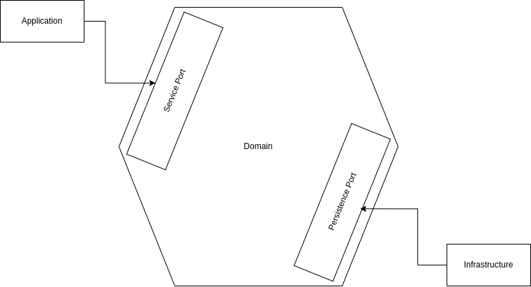

# Ibge adapter hexagonal architecture

This project is a microservice adapter of ibge's api.
An adapter of an external api has a lot of benefits, 
for an architecture of microservices it's better to have an abstraction of an external api, 
that abstracts external changes and isolate for more robust systems.

## Hexagonal Architecture
Also known as ports and adapters architecture, it isolates the domain
from other modules, decoupling it from external dependencies.

## Project

It's separated in modules, where each module has a specific job:
* Application: Contains inbound adapters;
* Domain: Isolated layer that applies the business logic and contains the ports;
* Infrastructure: Contains outbound adapters;
* Launcher: Contains configurations and the application launcher.

## Technologies
- Java 17 
- Spring Boot 
  - Spring web
  - Spring actuator
  - Spring Webflux
  - Spring Test
- Lombok
- Junit
- Mockito
- Wiremock